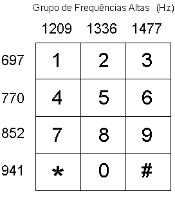
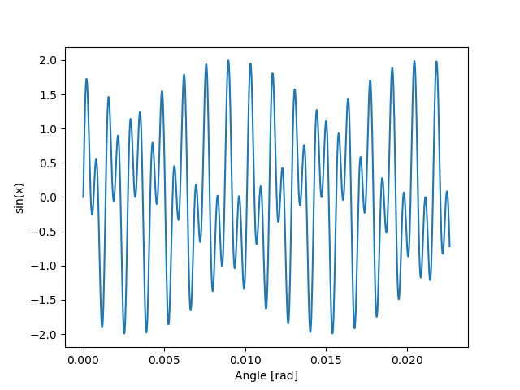
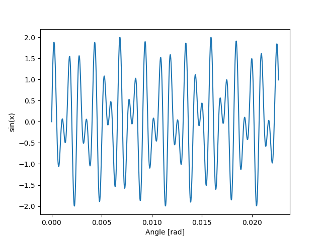
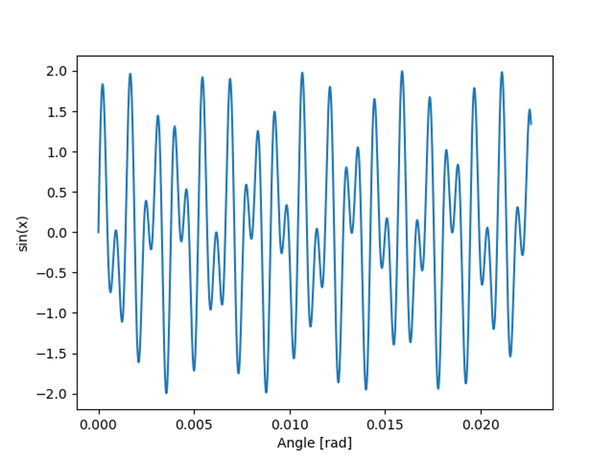
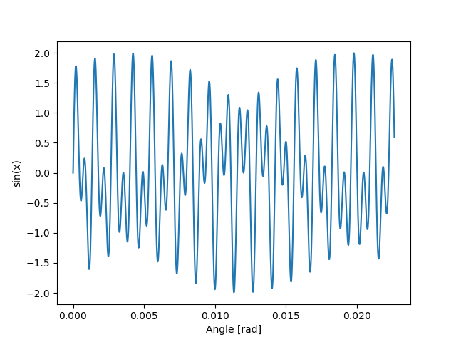
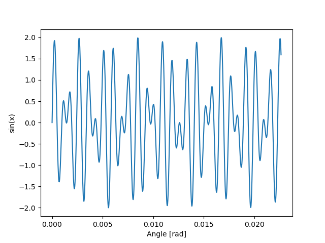
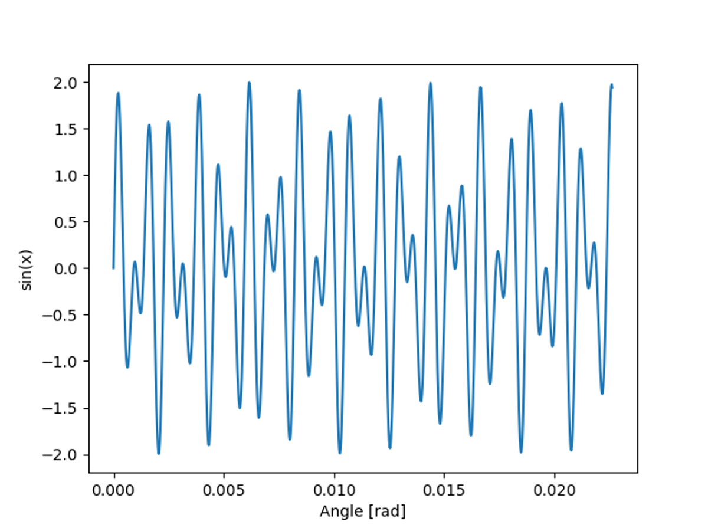
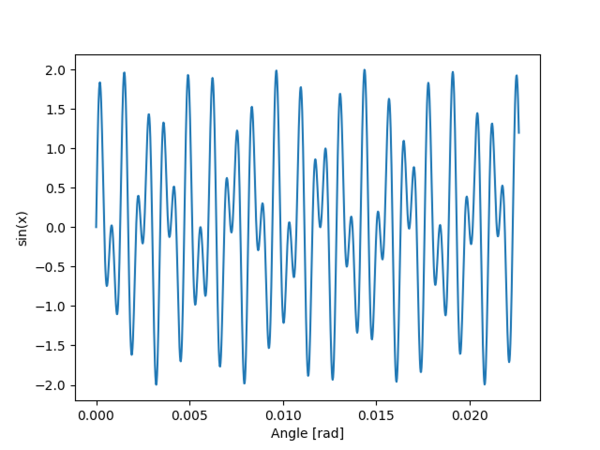
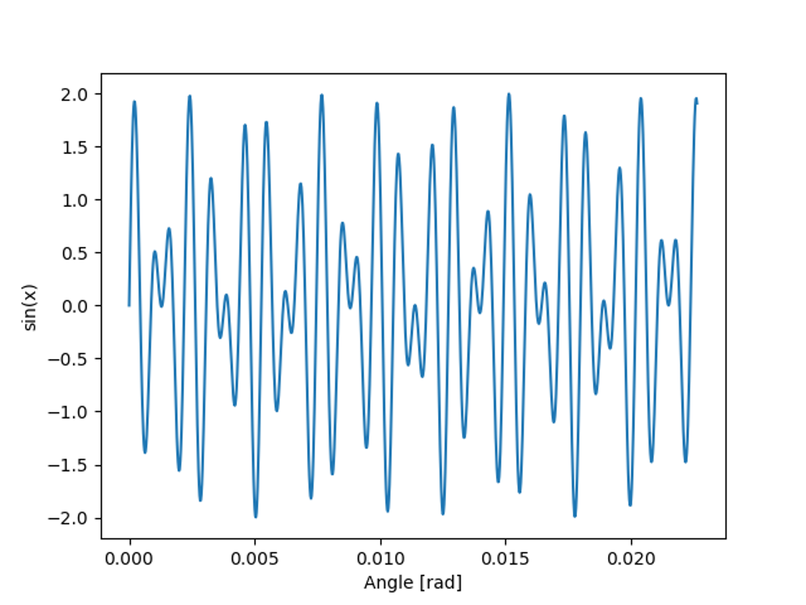

# Camada Física - Projeto 2 - DTMF
Gabriel Moreira e Eduardo Tirta

## Geração de tons
 Cada tom é uma combinação de duas senoides de frequências diferentes, seguindo a tabela DMTF, as senoides foram geradas utilizando a biblioteca numpy, e depois somadas, formando uma senoide única.
 
## Frequências de composição dos tons
 O tom segue o padrão das frequências da tabela abaixo.

## Gráficos de resposta dos tons

| Tom |                 Original                  |             Resposta             |
|-----| ----------------------------------------- | -------------------------------- |
|  1  |   |   |
|  2  |   |  |
|  3  |   |  |
|  4  |   |   |
|  5  |   |   |
|  6  |   |   |
|  7  |   |   |
|  8  |   |   |
|  9  |   |   |
|  0  |   |   |

 
