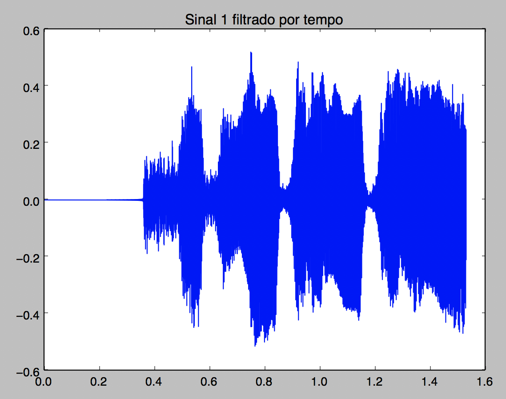

# Projeto 3 - Modulação

## Modulação e demodulação

**Modulação**: é o método de variação de amplitude (no caso da modulação _AM_) de um sinal de acordo com uma frequência portadora definida anteriormente.

_Modulação em AM e FM_

---

**Demodulação**: para conseguir interpretar o sinal modulado recebido, deve multiplicar o sinal pela portadora, ou seja, fazer a modulação em cima de um sinal já modulado, assim, o sinal será deslocado novamente, conseguindo ser interpretado na origem.

## Frequências das portadoras utilizadas
As frequências portadoras escolhidas foram 9000 _Hz_ e 17000 _Hz_.

**Fourier portadora 1**

---

 **Fourier portadora 2**

## Bandas ocupadas

A banda ocupada pelo sinal é de 7000 _Hz_ pois assim que o arquivo de cada áudio é lido, o sinal passa por um filtro passa baixa que elimina frequências acima de 3500 _Hz_. Posteriormente é feita a modulação desse sinal cortado, ou seja, a parte negativa do áudio é deslocada de modo que tudo fique positivo. Deste modo, a banda passa a ter o dobro do seu tamanho cortado.

## Gráficos do processo

### Transmissor

**Sinais filtrados no tempo**

|           Sinal 1            |           Sinal 2        |
|------------------------------|--------------------------|
|      |  | 

---

**Fourier dos sinais filtrados**

|           Sinal 1           |           Sinal 2        |
|-----------------------------|--------------------------|
|    | | 

---

**Fourier das portadoras**

|          Portadora 1                        |        Portadora 2       |
|-----------------------------                |--------------------------|
|    | | 

---

**Fourier dos sinais modulados**

|          Sinal 1                            |        Sinal 2       |
|-----------------------------                |--------------------------|
|     | | 

---

**Fourier da soma dos sinais modulados**

---

### Receptor 

**Sinal recebido no tempo**

---

**Fourier do sinal recebido**

---

**Sinal recebido demodulado no tempo**

|          Sinal 1                                |        Sinal 2       |
|-----------------------------                    |--------------------------|
|    | | 

---

**Fourier do sinal recebido**

|          Sinal 1                                |        Sinal 2       |
|-----------------------------                    |--------------------------|
|    | | 

## Resultados

Os sinais ficaram bem parecidos com os sinais enviados, porém os áudios ficaram um pouco mais "robotizados" e houve uma mínima perda de qualidade.