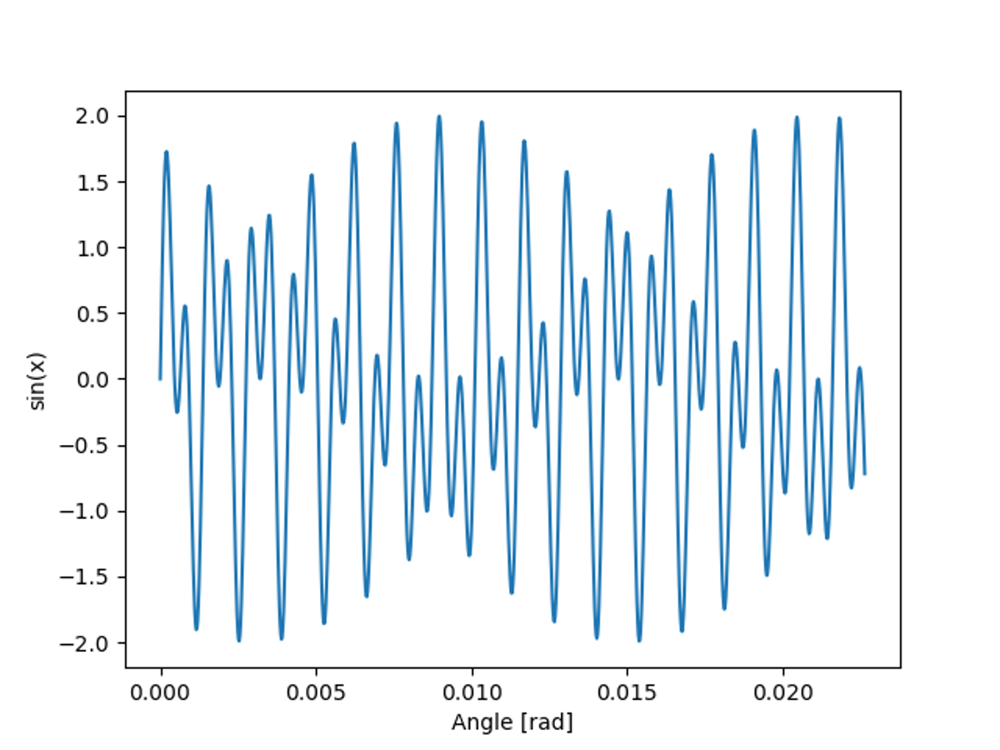
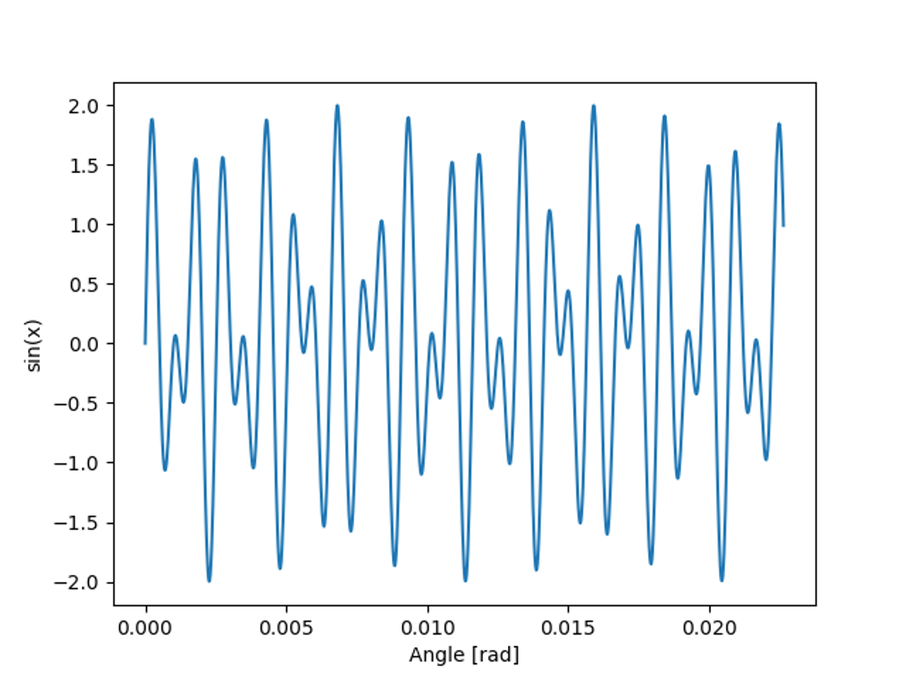
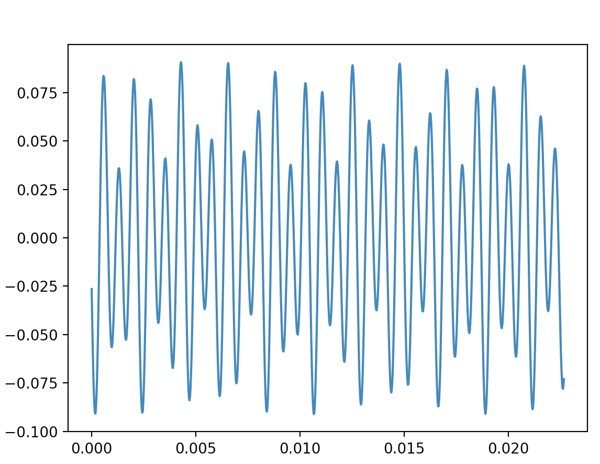
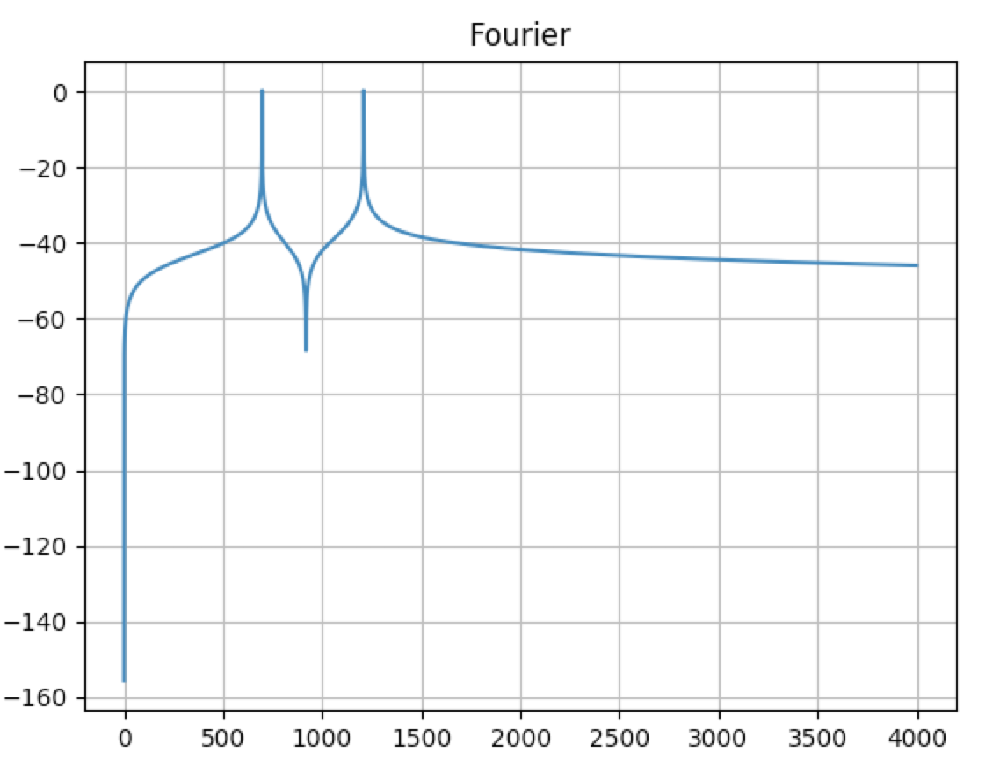
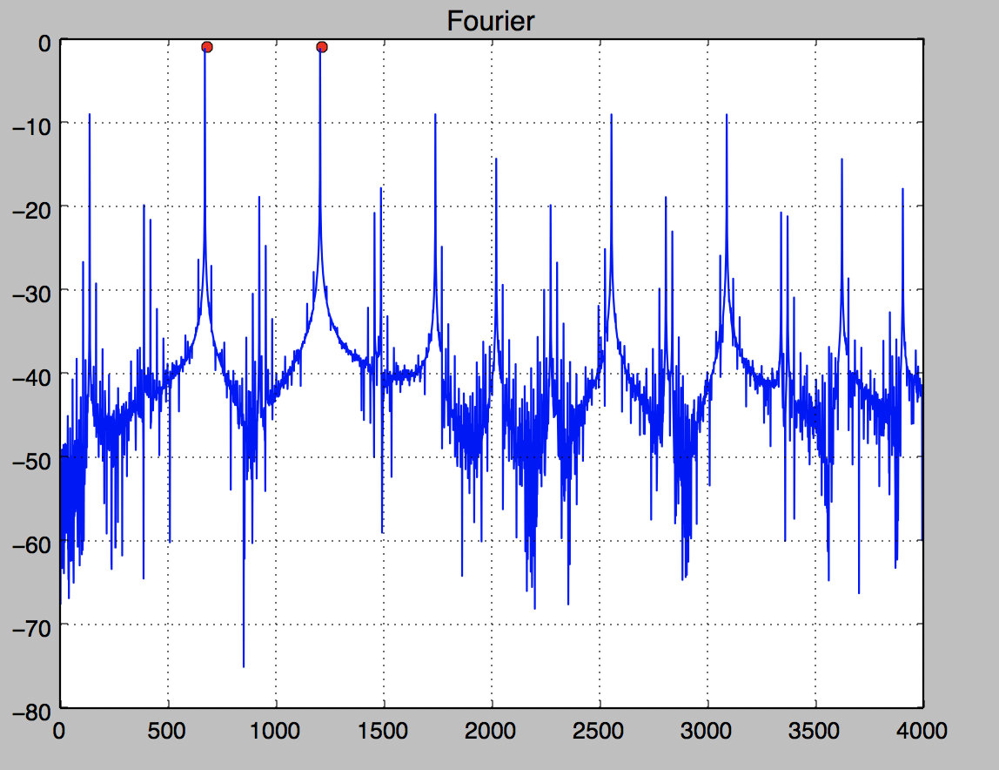
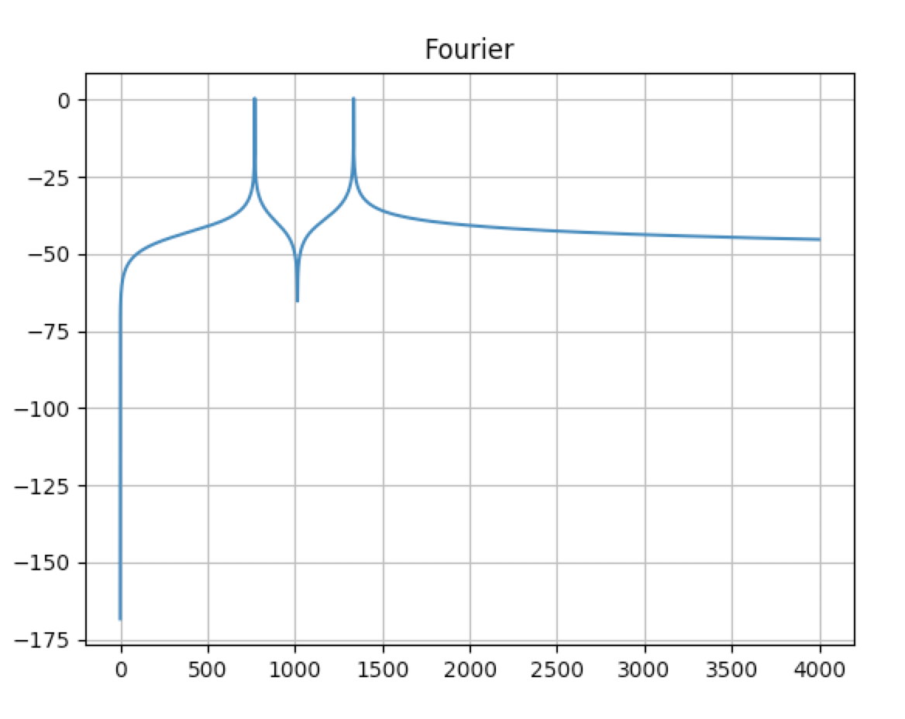
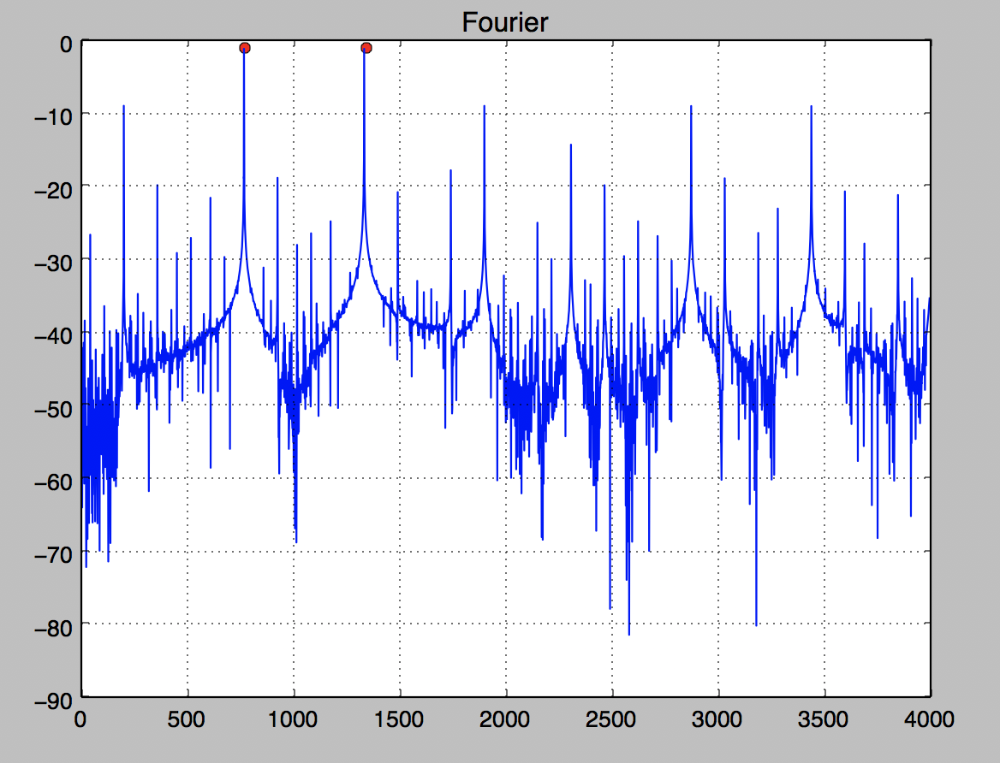
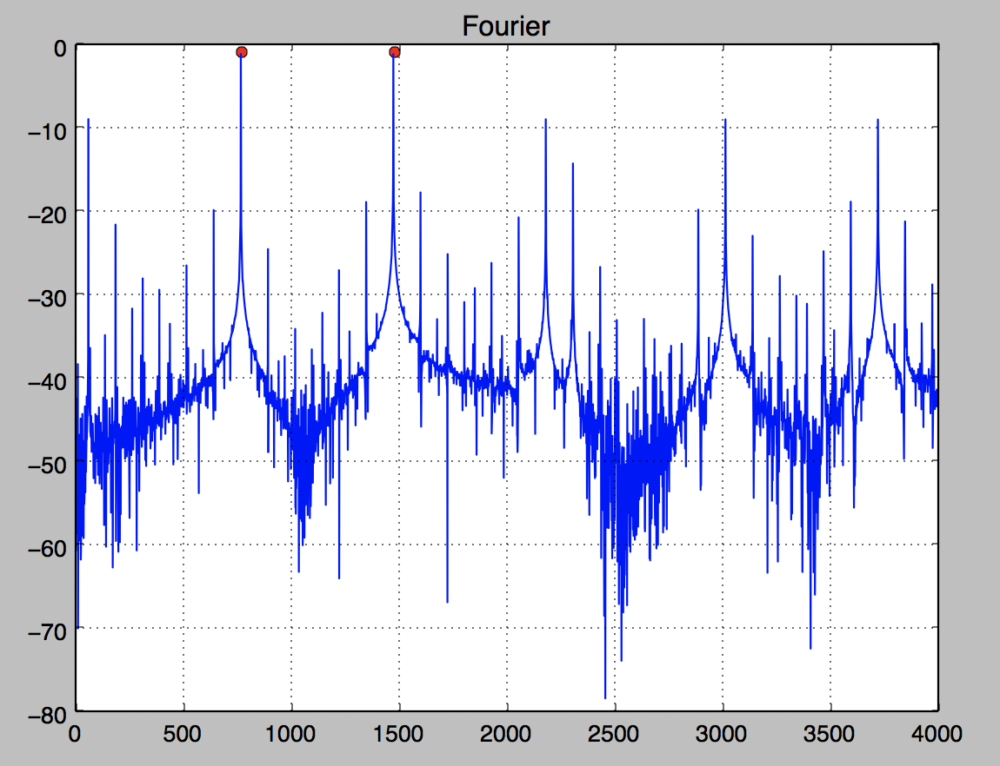
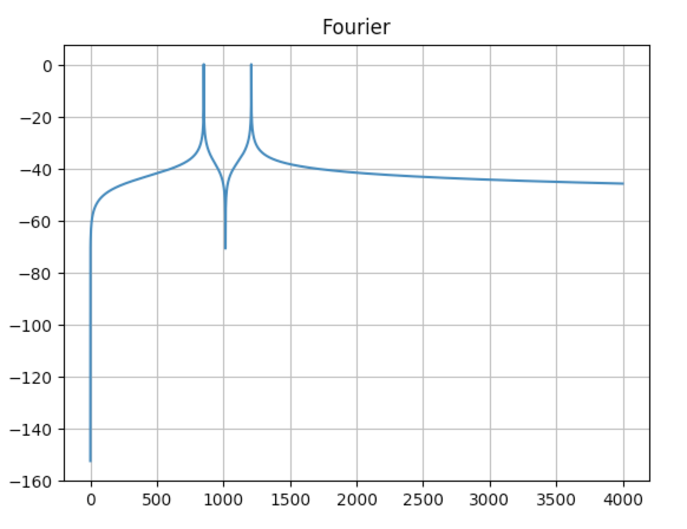
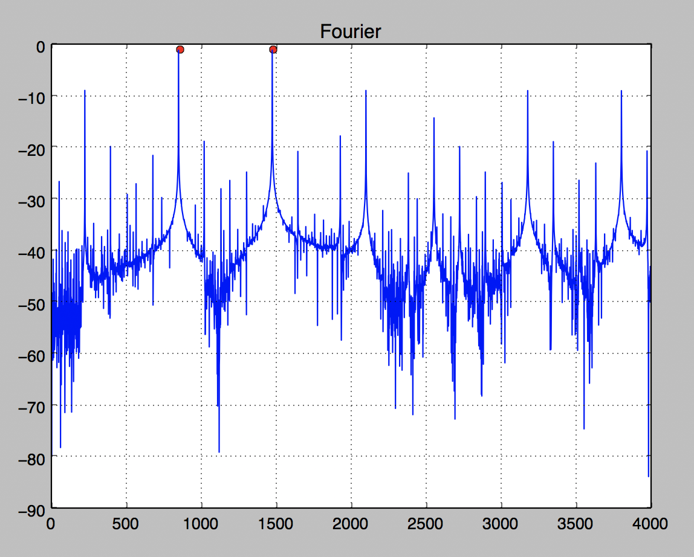

# Camada Física - Projeto 2 - DTMF
Gabriel Moreira e Eduardo Tirta

## Geração de tons
 Cada tom é uma combinação de duas senoides de frequências diferentes, seguindo a tabela DMTF, as senoides foram geradas utilizando a biblioteca numpy, e depois somadas, formando uma senoide única.
 
 ### Representação
 
 
## Frequências de composição dos tons
 O tom segue o padrão das frequências da tabela abaixo.

| **Hz**  |**1209**|**1336**|**1633**|
| --------| -------| ------ | ------ |
| **697** |    1   |    2   |    3   |
| **770** |    4   |    5   |    6   |
| **852** |    7   |    8   |    9   |
| **941** |        |    0   |        |

## Gráficos de resposta dos tons

| Tom |                 Original                  |             Resposta             |
|-----| ----------------------------------------- | -------------------------------- |
|  1  |   |   |
|  2  |   |  |
|  3  |   |  |
|  4  |   |   |
|  5  |   |   |
|  6  |   |   |
|  7  |   |   |
|  8  |   |   |
|  9  |   |   |
|  0  |   |   |

A diferença entre o tom original e o recebido ocorre, principalmente, por captar ruídos do ambiente externo, além disso a uma perda que faz com que a amplitude do gráfico altere

| Tom |                 Original                  |             Resposta             |
|-----| ----------------------------------------- | -------------------------------- |
|  1  |   |   |
|  2  |   |  |
|  3  |   |  |
|  4  |   |   |
|  5  |   |   |
|  6  |   |   |
|  7  |   |   |
|  8  |   |   |
|  9  |   |   |
|  0  |   |   |

